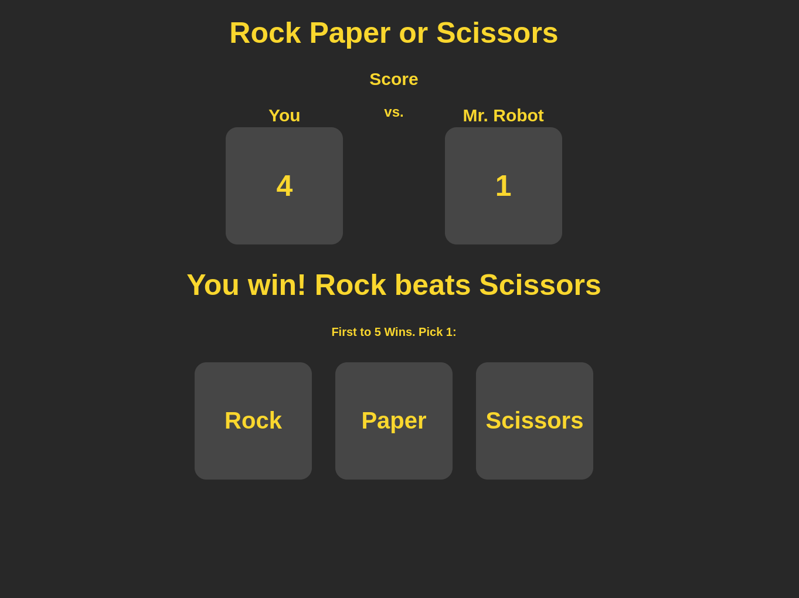

# TOP-Rock-Paper-Scissors

Project from [The Odin Project](https://www.theodinproject.com/)

## [Live Demo](https://gustav72.github.io/TOP-Rock-Paper-Scissors/)

### Technologies Used

JavaScript

HTML5

CSS3

Git

### Overview

This project involves DOM manipulation with JavaScript. Game logic is written in JavaScript. A "random" computer choice is up against the users desired choice. The game displays the outcome of every round. Every time someone wins a round they get a point. The first to 5 wins the game. I had a lot of fun creating this project!

Thank You for taking the time to look at my work!
